# Submission for Part 1

## Exercise 1.1 - Getting started

```bash
# make sure no containers are running
docker stop $(docker ps -a -q)
# make sure stopped containers are removed
docker rm $(docker ps -a -q)

# start a container running nginx 3 times
docker run -d --name nginx-1 nginx
docker run -d --name nginx-2 nginx
docker run -d --name nginx-3 nginx

# list the running containers
docker ps
# CONTAINER ID        IMAGE               COMMAND                  CREATED             STATUS              PORTS               NAMES
# 3901f630fb29        nginx               "nginx -g 'daemon of…"   6 seconds ago       Up 5 seconds        80/tcp              nginx-3
# 9d5294519978        nginx               "nginx -g 'daemon of…"   7 seconds ago       Up 6 seconds        80/tcp              nginx-2
# c762ea4f222a        nginx               "nginx -g 'daemon of…"   12 seconds ago      Up 11 seconds       80/tcp              nginx-1

# let's stop nginx-2 and nginx-3
docker stop nginx-2 nginx-3

# let's check only nginx-1 is running
docker ps
# CONTAINER ID        IMAGE               COMMAND                  CREATED              STATUS              PORTS               NAMES
# c762ea4f222a        nginx               "nginx -g 'daemon of…"   About a minute ago   Up About a minute   80/tcp              nginx-1
```

The output can be seen here:

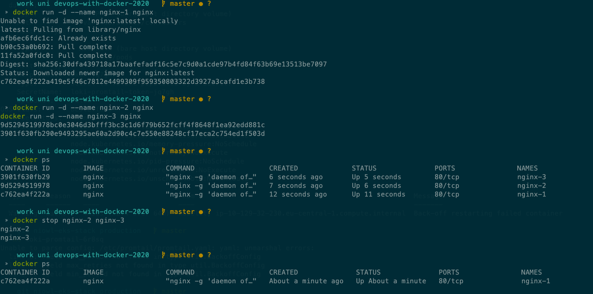

## Exercise 1.2 - Cleanup

```bash
# cleanup the docker containers
# stop the final nginx-1 container
docker stop nginx-1

# remove the docker containers
docker rm nginx-1 nginx-2 nginx-3

# check
docker ps

# now cleanup all images from my machine (bye bye)
docker rmi $(docker images -a -q)

# check what's left
docker ps -a
docker images
```

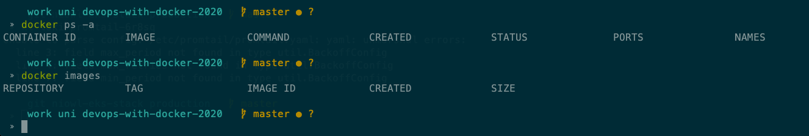

## Exercise 1.3 - Hello Docker Hub

```bash
docker run -it devopsdockeruh/pull_exercise
# Give me the password: basics
# You found the correct password. Secret message is:
# "This is the secret message"
```

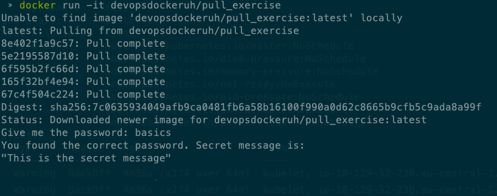

## Exercise 1.4

```bash
# start the exec_bash_exercise container
docker run -d --rm --name bash-exercise devopsdockeruh/exec_bash_exercise

# connect to the running container and tail -f ./logs.txt
docker exec -ti bash-exercise /bin/bash
# inside the container run
tail -f ./logs.txt
```

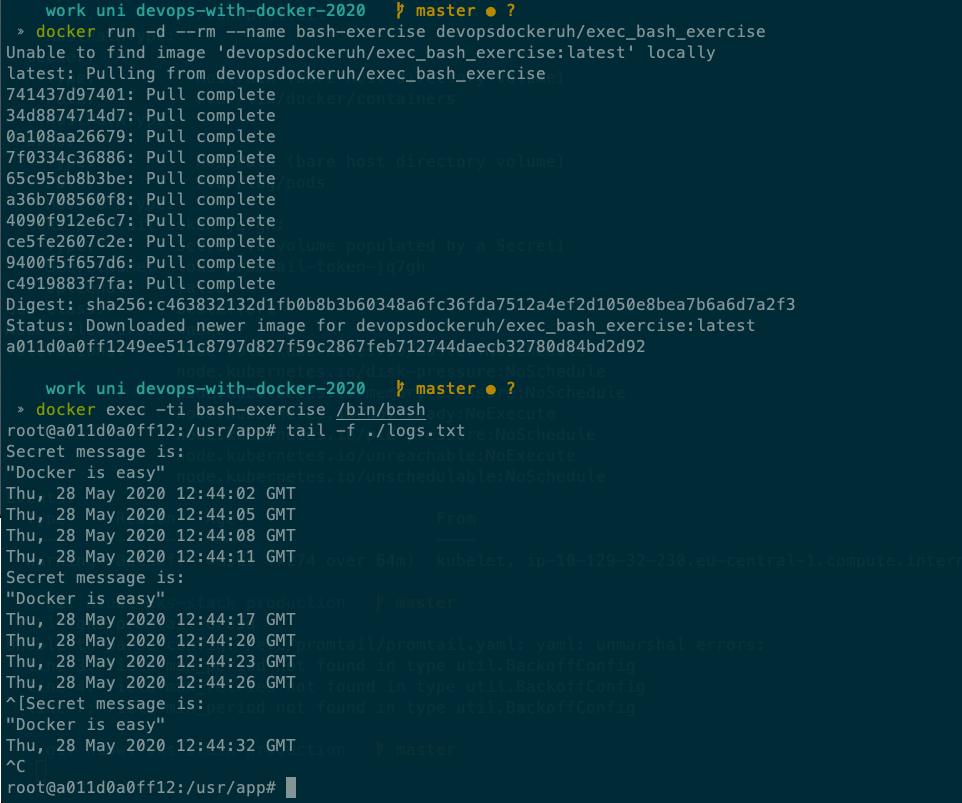

## Exercise 1.5

```bash
# this is really hacky and a Dockerfile should be used for install curl...
# did not want to jump ahead of the exercises :)
docker run --rm -ti ubuntu bash -c '\
    apt update \
    && apt install -y -qq --no-install-recommends \
        ca-certificates \
        curl \
    && echo "Input website:"; read website; echo "Searching.."; sleep 1; curl http://$website;'

# in the prompt enter a website like:
> helsinki.fi
# Input website:
# helsinki.fi
# Searching..
# <!DOCTYPE HTML PUBLIC "-//IETF//DTD HTML 2.0//EN">
# <html><head>
# <title>301 Moved Permanently</title>
# </head><body>
# <h1>Moved Permanently</h1>
# <p>The document has moved <a href="http://www.helsinki.fi/">here</a>.</p>
# </body></html>
```

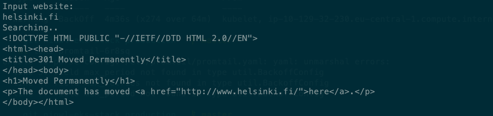

## Exercise 1.6

See the [Dockerfile](./ex-1.6/Dockerfile) for `docker-clock`

```bash
# build the Dockerfile
docker build -t docker-clock part1/ex-1.6

# run the image
docker run --rm -ti docker-clock
```

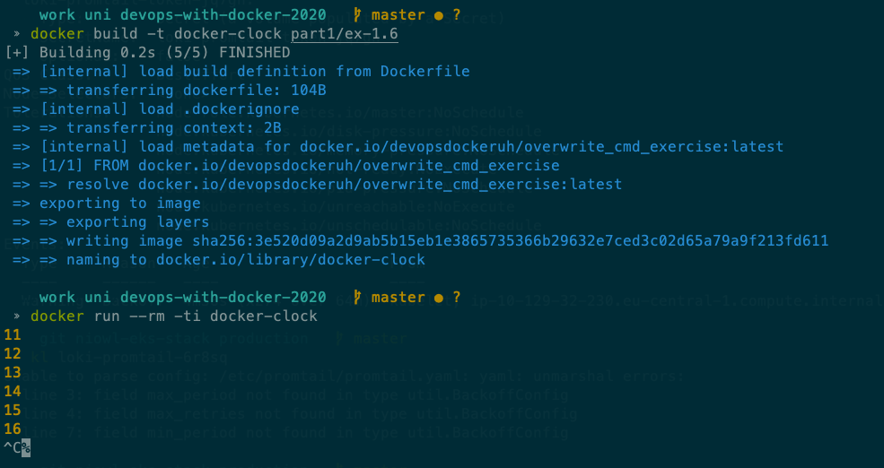

## Exercise 1.7

See the [Dockerfile](./ex-1.7/Dockerfile) for `curler`

```bash
# build the Dockerfile
docker build -t curler part1/ex-1.7

# run the image
docker run --rm -ti curler
# enter in the prompt
> helsinki.fi
# Input website:
# helsinki.fi
# Searching..
# <!DOCTYPE HTML PUBLIC "-//IETF//DTD HTML 2.0//EN">
# <html><head>
# <title>301 Moved Permanently</title>
# </head><body>
# <h1>Moved Permanently</h1>
# <p>The document has moved <a href="http://www.helsinki.fi/">here</a>.</p>
# </body></html>
```

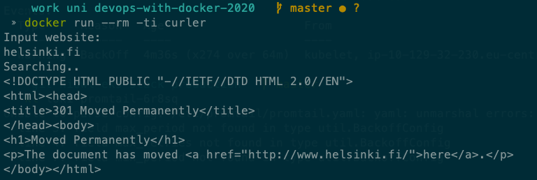

## Exercise 1.8

```bash
# first create the log file locally so that it can be mounted
touch part1/ex-1.8/logs.txt

# then run the container and mount the file
docker run --rm -ti -v $(pwd)/part1/ex-1.8/logs.txt:/usr/app/logs.txt devopsdockeruh/first_volume_exercise
# (node:1) ExperimentalWarning: The fs.promises API is experimental
# Wrote to file /usr/app/logs.txt
# Wrote to file /usr/app/logs.txt
# Wrote to file /usr/app/logs.txt

# check that the logs were captured
cat part1/ex-1.8/logs.txt
# Thu, 28 May 2020 19:35:39 GMT
# Thu, 28 May 2020 19:35:42 GMT
# Thu, 28 May 2020 19:35:45 GMT
```

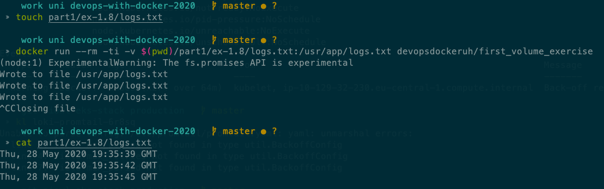

## Exercise 1.9

```bash
# run the container a publish on port 80 in detached mode
docker run --rm -p 80:80 -d --name ports devopsdockeruh/ports_exercise

# check the port is open
curl localhost
# Ports configured correctly!!

# stop the container
docker stop ports
```

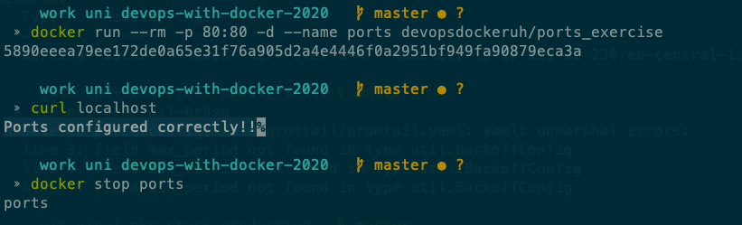

## Exercise 1.10

Please check the [Dockerfile](./ex-1.10/frontend-example-docker/Dockerfile)

```Dockerfile
FROM node:10.20

COPY . .

RUN npm install

EXPOSE 5000

ENTRYPOINT ["npm"]
CMD ["start"]
```

## Exercise 1.11

Please check the [Dockerfile](./ex-1.11/backend-example-docker/Dockerfile)

```Dockerfile
FROM node:10.20

COPY . .

RUN npm install

EXPOSE 8000

ENTRYPOINT ["npm"]
CMD ["start"]
```

## Exercise 1.12

Please check the frontend [Dockerfile](./ex-1.10/frontend-example-docker/Dockerfile)

Please check the backend [Dockerfile](./ex-1.11/backend-example-docker/Dockerfile)

```Dockerfile
# Frontend Dockerfile
FROM node:10.20

COPY . .

RUN npm install

EXPOSE 5000

ENV API_URL=http://localhost:8000

ENTRYPOINT ["npm"]
CMD ["start"]
```

```Dockerfile
# Backend Dockerfile
FROM node:10.20

COPY . .

RUN npm install

EXPOSE 8000

ENV FRONT_URL=http://localhost:5000

ENTRYPOINT ["npm"]
CMD ["start"]
```

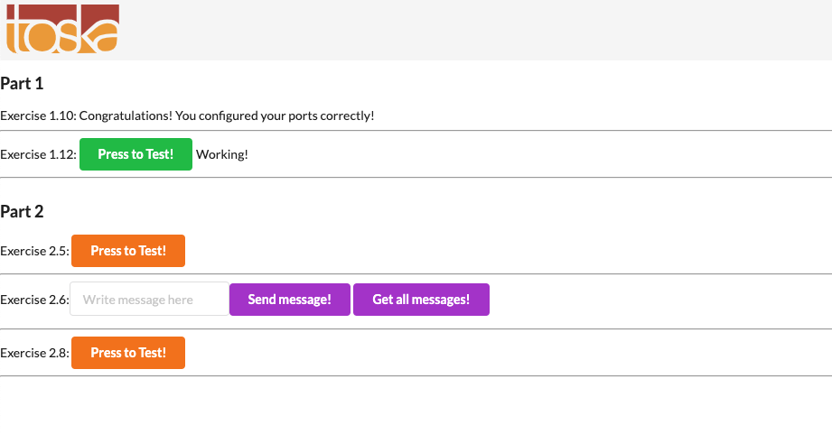

## Exercise 1.13

Please check the [Dockerfile](./ex-1.13/spring-example-project/Dockerfile)

```bash
# build the docker image
docker build -t spring-example .

# run the docker image
docker run --rm -ti -p 8080:8080 spring-example
```

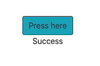

## Exercise 1.14

Please check the [Dockerfile](./ex-1.14/rails-example-project/Dockerfile)

```bash
# build the docker image
docker build -t rails-example .

# run the docker image
docker run --rm -ti -p 3000:3000 rails-example
```

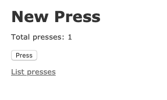 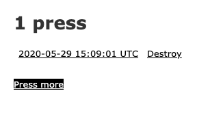

## Exercise 1.15

Please check the [Dockerfile](./ex-1.15/python-example-project/Dockerfile)

```bash
# build the docker image
docker build -t python-example .

# run the docker image
docker run --rm -ti -p 8888:8888 python-example
```


## Exercise 1.16

Created a project in heroku called `devopswithdocker`

```bash
# pull the original image
docker pull devopsdockeruh/heroku-example:latest

# tag it with the heroku registry and project name
docker tag devopsdockeruh/heroku-example:latest registry.heroku.com/devopswithdocker/web:latest

# release/deploy the docker container
heroku container:release web -a=devopswithdocker

# open the web browser
heroku open -a=devopswithdocker
```

Deployed application URL is <https://devopswithdocker.herokuapp.com/>

## Exercise 1.17 - Python Development Environment

Decided to build a command line development environment with Python

The setup includes:

- *git*: for version control
- *pyenv*: installing multiple versions of python
- *vim*: text editor
- *zsh*: nice shell to use

```Dockerfile
FROM ubuntu:18.04

ENV LC_ALL C.UTF-8
ENV LANG C.UTF-8
ENV PYENV_SHELL bash

ARG PYTHON_VERSION=3.8.3

# Install dependencies
RUN apt-get update \
    && DEBIAN_FRONTEND=noninteractive apt-get install -y -qq --no-install-recommends \
    # dependencies for pyenv install
    ca-certificates \
    curl \
    git \
    # dependencies for building python
    build-essential \
    zlib1g-dev \
    libncurses5-dev \
    libgdbm-dev \
    libnss3-dev \
    libssl-dev \
    libreadline-dev \
    libffi-dev \
    libsqlite3-dev \
    wget \
    libbz2-dev\
    # terminal experience
    zsh \
    # cleanup
    && rm -rf /var/lib/apt/lists/*

RUN git clone git://github.com/robbyrussell/oh-my-zsh.git ~/.oh-my-zsh \
    && git clone --depth 1 git://github.com/junegunn/fzf.git ~/.fzf \
    && ~/.fzf/install --key-bindings --completion --no-update-rc --no-bash \
    && git clone --depth 1 git://github.com/zsh-users/zsh-autosuggestions.git ~/.oh-my-zsh/custom/plugins/zsh-autosuggestions \
    && git clone --depth 1 git://github.com/zsh-users/zsh-syntax-highlighting.git ~/.oh-my-zsh/custom/plugins/zsh-syntax-highlighting \
    && chsh -s $(which zsh)


COPY zshrc ~/.zshrc

# Install pyenv for installing appropriate python versions
RUN curl https://pyenv.run | bash
ENV PATH /root/.pyenv/bin:/root/.pyenv/shims:${PATH}
RUN pyenv install ${PYTHON_VERSION}

ENTRYPOINT ["/bin/bash"]
```

You can specify the version of python that you want to install using the build argument `PYTHON_VERSION`

```bash
docker build --build-arg PYTHON_VERSION=3.7.0 -t pydev .
```
